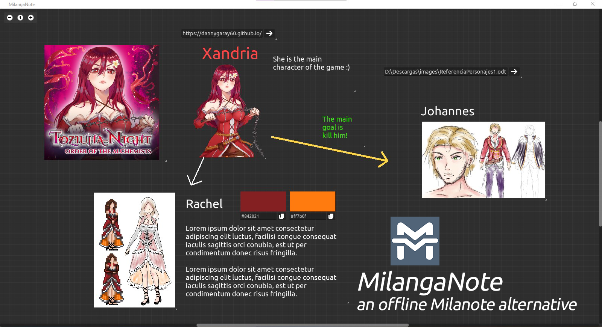

# MilangaNote
Debido a que no pienso pagar por una subscripción para usar `Milanote`, entonces decidí crear mi propia app clon en [Godot Engine 4.2](https://godotengine.org/)!

## ¿Qué puedo hacer con MilangaNote?
Puedes crear proyectos en donde puedes añadir `Textos, Encabezados, Imágenes, flechas, Referencia de colores, Enlaces web` y todo esto con la finalidad de organizar tus ideas. Puede servir para planear historias, diseñar videojuegos etc.

## ¿Cómo usar el programa?
Aquí está un video que muestra el uso del programa además de como configurarlo:

## ¿Donde lo puedo descargar?
Está disponible como un ejecutable, revisa en [Releases](https://github.com/dannygaray60/milanganote/releases). También puedes descargar este repositorio y abrirlo en GodotEngine 4.2 para compilarlo a otra plataforma.

## Bugs / Problemas conocidos
Debido a que este programa lo desarrollé en poco tiempo y para uso personal en mi videojuego [Toziuha Night](https://dannygaray60.github.io/tn-oota.html), el código fuente no está a prueba de errores, por lo que no doy garantías de que funcione perfectamente. Por ahora los errores que he podido encontrar son:

 - Al cambiar el tamaño de letra del nodo `Encabezado` o `Texto` si se selecciona otro nodo del mismo tipo, el tamaño de la letra se transfiere. Por lo que cuando se editan las propiedades del nodo hay que hacer click en un espacio vacío para evitarlo.
 - El nodo de `Flecha` no tiene antialiasing y no se ve bien al aumentar mucho su grosor de línea
 - Los datos del proyecto se guardan en formato JSON, recomiendo no editar este archivo manualmente ya que si el programa encuentra algún error al leer el archivo éste podría corromperse.
 - El archivo JSON resultante no está embellecido por lo que no es fácil editarlo de forma manual.
 
 ## Actualizaciones
 Obviamente el programa tiene muchas cosas por mejorar o agregar, pero como he dicho antes, MilangaNote fue desarrollado para uso personal, así que de mi parte no habrá más actualizaciones o mejoras si no son necesarias para mi uso. Pero cualquiera tiene derecho a mejorar el programa y crear algún pull request.
 
## Créditos
Desarrollado por [Danny Garay](https://dannygaray60.github.io/index.html)
Íconos proporcionados por [Flaticon.com](https://www.flaticon.com/)
